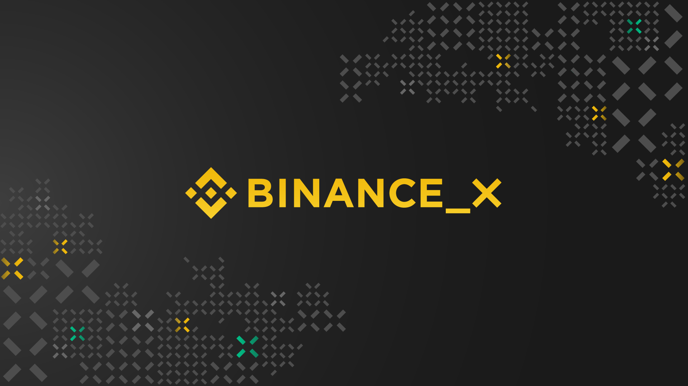

# Binance X development grants program

  

As part of our commitment to promoting the Binance Smart Chain ecosystem... 

---

- [:clipboard: About](#clipboard-about)
- [:bookmark_tabs: Guidelines](#bookmark_tabs-guidelines)
  - [Licensing](#licensing)
  - [Documentation](#documentation)
- [:pencil: Process](#pencil-process)
- [:rocket: RFP List](#mailbox_with_mail-rfp-suggestion)
- [:bulb: Help](#bulb-help)
  - [Additional information](#additional-information)
  - [Real-time conversation](#real-time-conversation)
- [:information_source: License](#information_source-license)

## :clipboard: About 
 

## :bookmark_tabs: Guidelines

### Licensing

### Documentation

## :pencil: Process

## :mailbox_with_mail: RFP List

## :rocket: Alternative Funding Sources

## :bulb: Help

### Additional information

* [Binance X Website](https://binancex.dev)

### Real-time conversation

## :information_source: License
[Apache License 2.0](https://github.com/binancex/Grant-projects/blob/main/LICENSE) © Binance X 